# Nucleo-64 `WL55JC1`
Primary development board line used in production of `STM32WL55xx` software. The Nucleo-64 board can be programmed from your computer using a *programmer*, which is a program that writes compiled machine code onto a processor's onboard Read-Only Memory (ROM). This is called *flashing*, and the ROM segment comprising of a program's data is referred to as the *program flash*.

This guide primarily pertains to configuration and program flashing using STM32CubeProgrammer, a program used to format and program STM32 chips. After the firmware is updated for the chip, it can be programmed in the command line or using an integrated development environment (IDE).

This guide will also provide working examples that can be flashed onto the STM32WL55xx to verify bootloader and compiler/programmer configurations are correct. 

> Note: The same configurations should apply to `WL55IC1` as well. Differences between the chips will be documented for clarity.

## Requirements
* STM32CubeProgrammer
* Keil uVision (optional if you know what you are doing)
> Command-line-only steps will be provided as an alternative to using uVision when I get around to documenting them.

## Program Installation

### STM32CubeProgrammer
STM32CubeProgrammer can be downloaded from [the STM32 official website](https://www.st.com/en/development-tools/stm32cubeprog.html). A mirror is also provided by this repository in case you are for some reason unable to retrieve a copy of the installer. Follow the provided installation steps.

### Keil uVision
Keil uVision can be installed [here](https://www.keil.com/demo/eval/arm.htm). Fill out the form shown on the page and proceed to program download.

When installing Keil uVision, feel free to skip the package intallation steps. We will cover that within the IDE after installation.

> I'll update this later to show pre-installation pack installation, I just don't want to reinstall Keil uVision right now.

## Configuration

### STM32CubeProgrammer
Once STM32CubeProgrammer is installed, you should be able to open it and see this window:

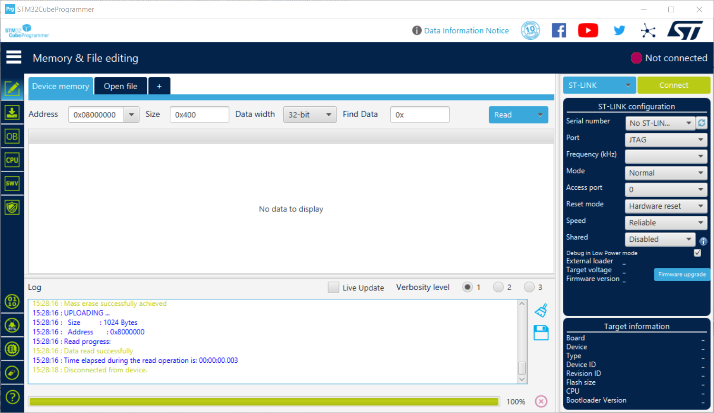

After you reach this window:
1. Connect the Nucleo-WL55JC1 (or IC1) to your computer via USB.
2. On the STL-LINK configuration page, click the refresh icon next to the `Serial number` entry. A serial number should appear: 

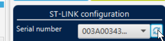

3. Set `Port` to `SWD`, `Frequency (kHz)` to `12000`, and `Mode` to `Under reset`. Your configuration should match the one shown here:

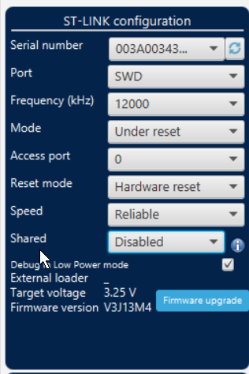

4. Open STLinkUpgrade by clicking on `Firmware upgrade` below the configuration form. The following window should appear:

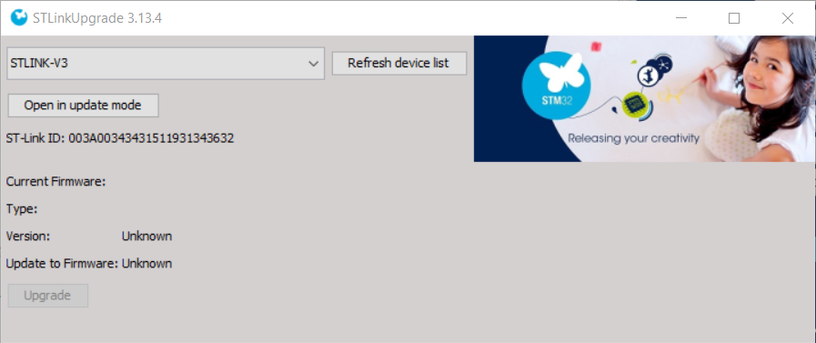

5. Click `Open in update mode`, and set `MCO Output` to `Off`:

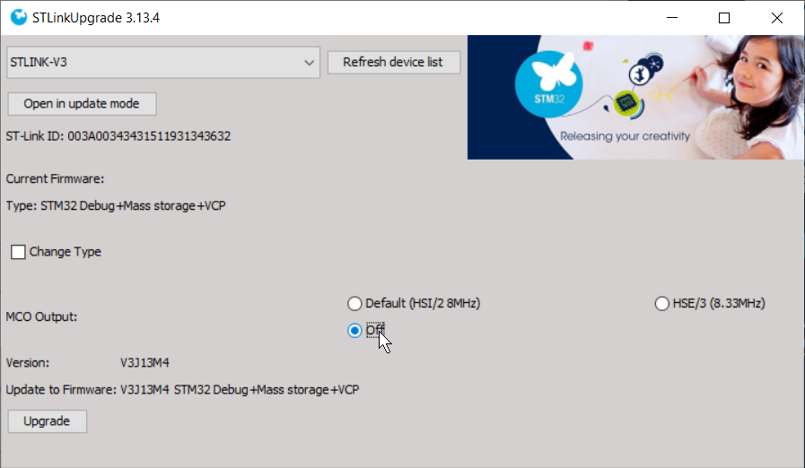

6. Click `Upgrade` and wait for the firmware to update. After the firmware has been successfully updated, the device should re-connect.

7. It is safe to close STLinkUpgrade and STM32CubeProgrammer.

### Keil uVision Configurations
After STM32CubeProgrammer updates are made, open Keil uVision. You should see an empty editor interface:

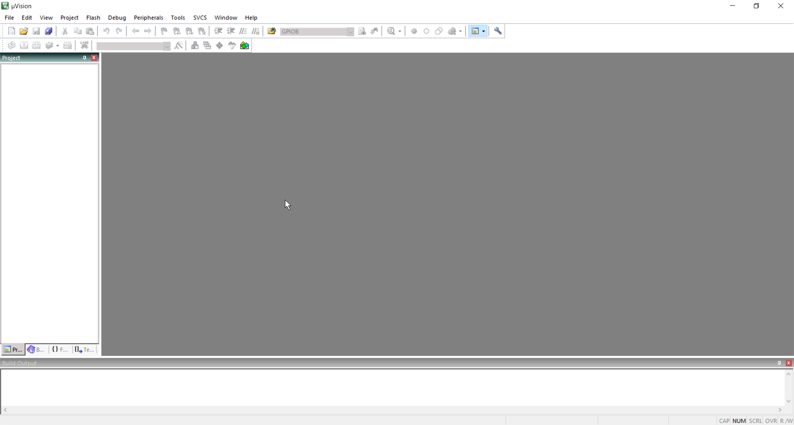

Before we build and flash any software, packages for ARM program compilation for the STM32 must be installed. Click the `Pack Installer` widget on the bottom toolbar:

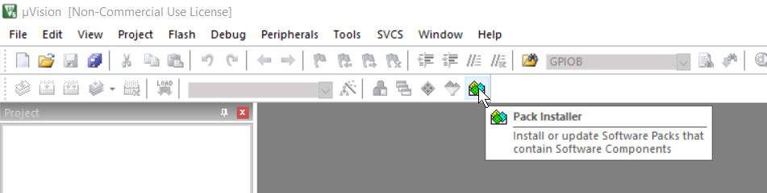

Once `Pack Installer` is open, give it a moment to load the packages list. When it is installed, you should see something like this:

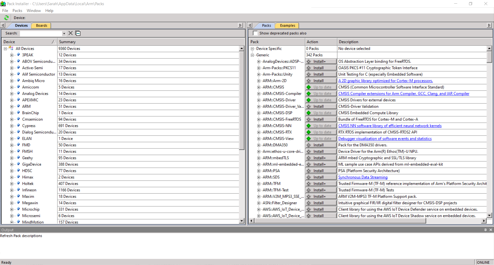

Once you can see this window, install the following dependencies:

* ARM::CMSIS
* ARM::CMSIS-Compiler
* ARM::CMSIS-Driver
* ARM::CMSIS-DSP
* ARM::CMSIS-NN
* ARM::CMSIS-RTX
* ARM::CMSIS-View
* Keil::ARM_Compiler
* Keil::MDK-Middleware

> To experienced readers: While NN, RTX, and DSP aren't necessary for most applications, STM32 projects seem to have linker errors without them installed. I haven't yet looked into why, or how to prevent it without installing these dependencies. If I do figure it out, I'll update this entry. Otherwise, feel free to leave an issue on how to solve the problem. Contributions are welcome!

Once the listed dependencies are installed, close the Pack Installer.

Open a new project via `Project > New µVision Project...`

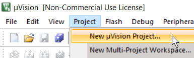

Choose where you want your project to be created. To avoid any file conflict issues, create an empty folder and put your project in there. I typically put my projects under `C:/Users/me/repos/...`:

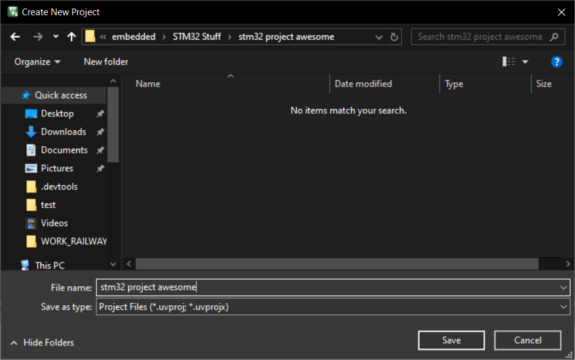

After clicking `Save`, this window should appear:

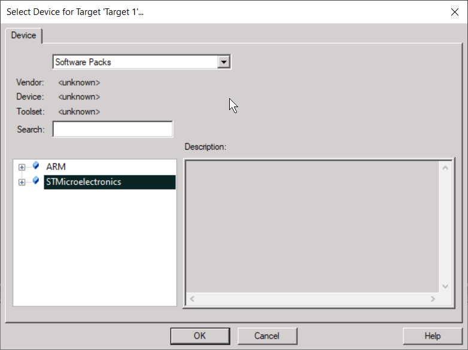

From there, you can choose which platform you want to build for. If your chip uses the CM4 chipset, selecy `STMicroelectronics > STM32WL Series > STM32WL55 > STM32WL55JCIx > STM32WL55JCx:CM4`:

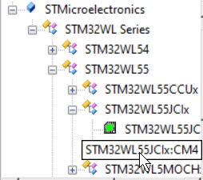

If you set the chipset configurations correctly, the `Manage Run-Time Environment` window should appear:

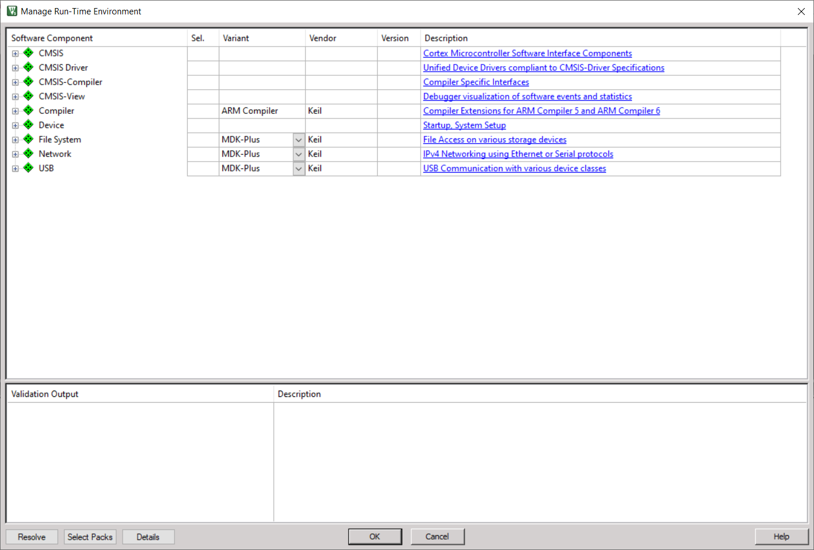

This is a list of all the software packs currently installed. To run our example program (and most programs), you will need to enable the following:

* `CMSIS > Core`
* `CMSIS-Compiler > Core`
* `Device > Startup`

The first two packages are necessary to compile our code into ARM platform code for the STM32 chips. The `Startup` package contains device information for the STM32WL55xx chip, and is necessary for compilation. Your dependency list should look something like this:

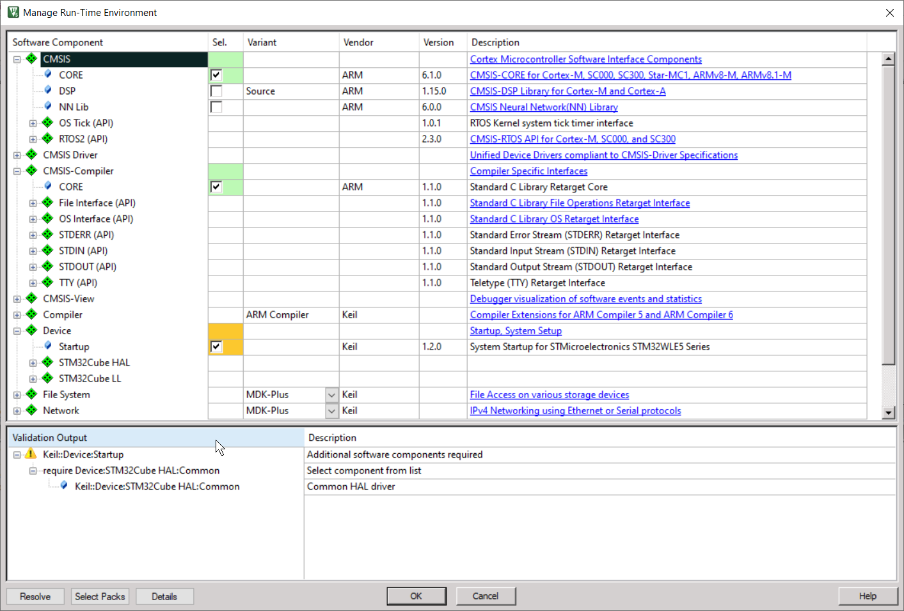

Once the necessary dependencies are enabled, click `OK` to proceed to the editor. To verify that the chip setup and IDE configuration is correct, we will build a sample program that lights LED1 on the development board.

## Programming
Create a new file under `Source Group 1` named `main.c`:

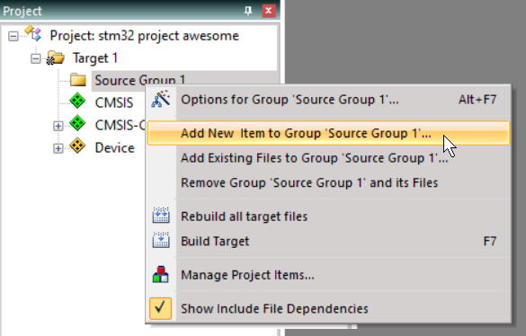

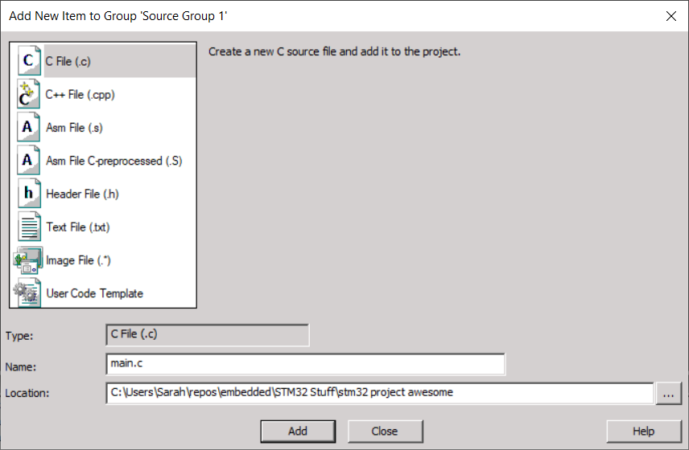

Copy the following source into `main.c`:

```c
#include <stm32wl55xx.h>

// Entry point function
int main() {
	// Activate GPIO Port B RCC clock to enable Port B I/O.
    RCC->AHB2ENR = RCC_AHB2ENR_GPIOBEN;
	
    // Set all GPIO pin B15 to output mode (0b01)
	GPIOB->MODER = (GPIOB->MODER & ~GPIO_MODER_MODE15) | GPIO_MODER_MODE15_0;

    // Repeating loop to avoid program reset.
	while (1) {
        // Set pin B15 (LED1 on Nucleo-WL55JC1 board) to HIGH
		GPIOB->BSRR |= GPIO_BSRR_BS15;
	}
}
```

Before this program can be compiled and flashed, configurations to the compiler need to be set. Click `Options for Target...` on the bottom toolbar to open the build settings menu:

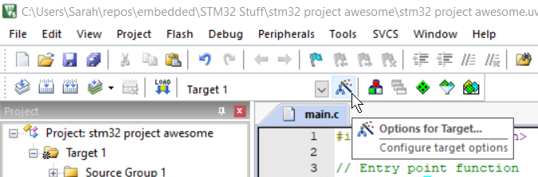

Under `Debug`, select the `ST-Link Debugger`:

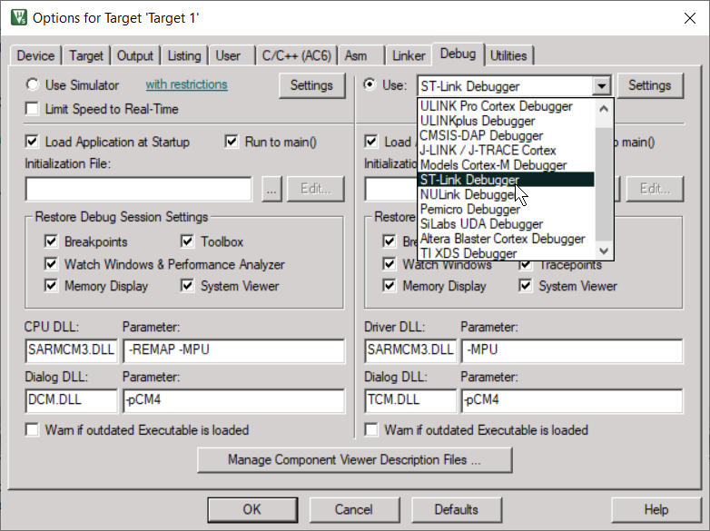

Click the `Settings` widget next to the debugger entry:

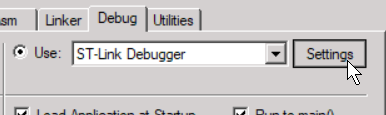

and set all configurations of clock speed to the default STM32 clock speed (32 MHz):

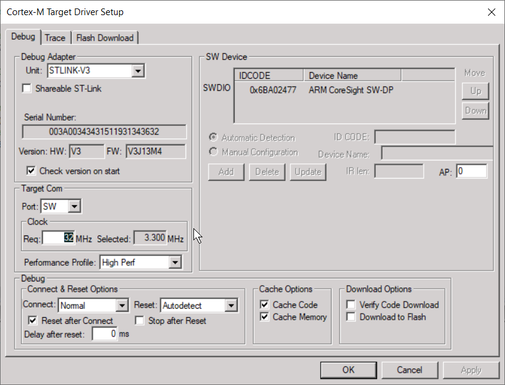
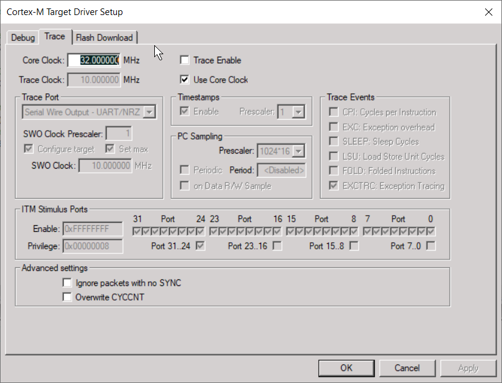

Then under `Flash Download`, select `Reset and Run` to enable execution of the program flash upon flash download:

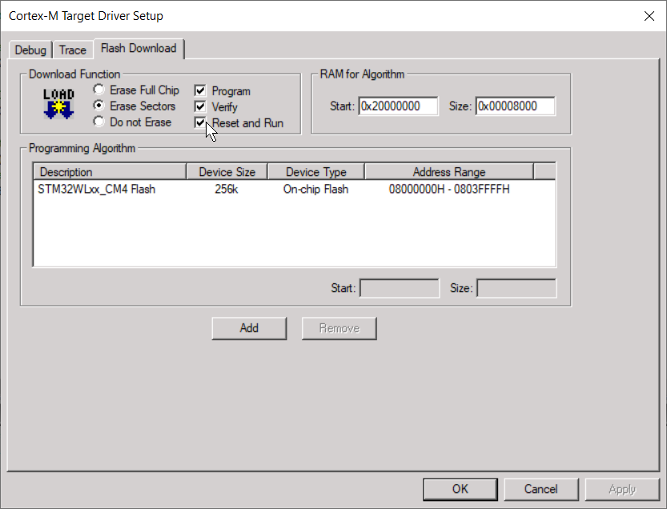

Click `OK` until all configuration menus are closed.

Build the program:

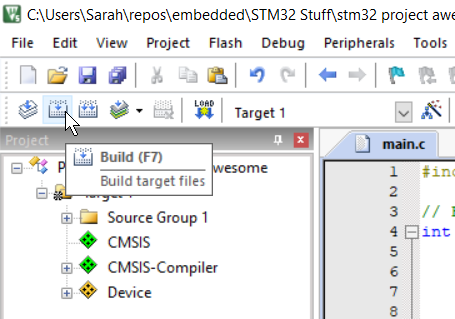

Then download the program into the `STM32WL55xx` chip:

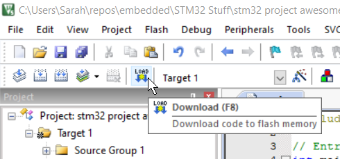

If compilation is successful (and configuration is correct), a blue LED should be enabled on the board:


# Contributing

I put this guide together in an afternoon. Please feel free to leave suggestions and report any problems in the issues thread!
